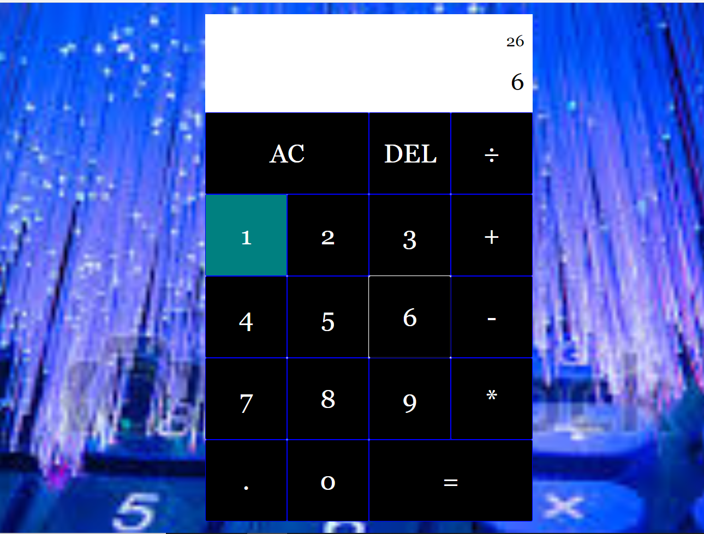

# Overview:
A classic calculator program. It Uses CSS, HTML, and JavaScript with Visual Studio Code and Github.

# Development Enviroment:
* Visual Studio Code
* HTML
* CSS
* JavaScript

# Execution:
* To execute the program: 'CALCULATORAPP'
* Go live on your ide

# Sample Output:

# Useful Websites:
* [W3school](https://www.W3shools.com/)